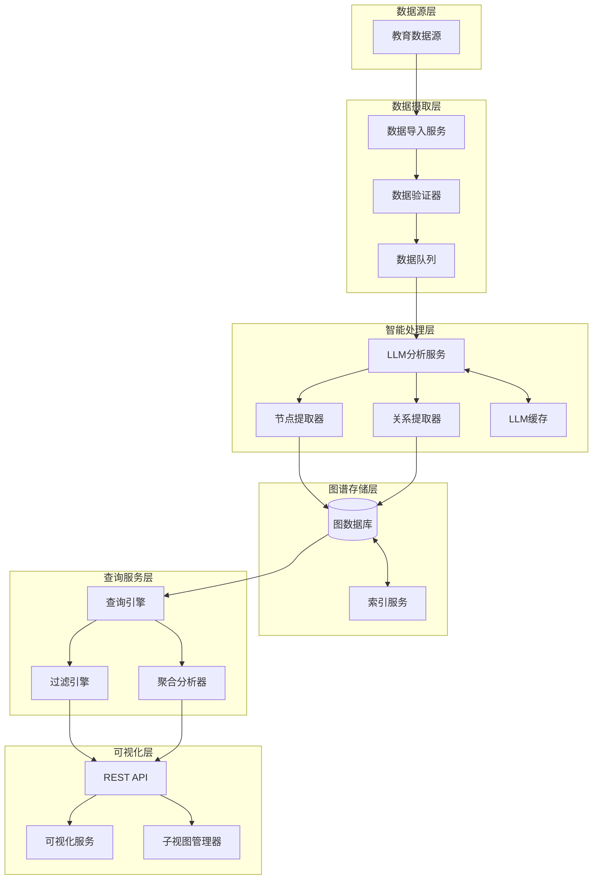

# 设计文档

## 概述

教育知识图谱神经网络系统是一个数据驱动的智能分析平台，旨在将教育项目中的多维度原始数据转换为结构化的知识图谱。系统的核心价值在于：
w

1. **智能数据处理**: 利用大语言模型（LLM）自动分析和理解教育数据的语义
2. **图谱构建**: 创建包含学生、教师、课程、知识点、错误类型等多类型节点的知识图谱
3. **关系挖掘**: 识别和建立节点之间的复杂关系，揭示学习模式和知识关联
4. **交互式探索**: 提供可视化界面支持用户深入探索和分析图谱数据
5. **洞察生成**: 通过图分析算法生成教育洞察和个性化建议

系统采用分层架构设计，将数据摄取、LLM 处理、图谱存储、查询服务和可视化展示解耦，确保各组件可独立扩展和维护。

## 架构

系统采用微服务架构，主要包含以下层次：

### 架构图



### 核心组件说明

1. **数据摄取层**

   - 负责从教育数据源读取原始数据
   - 验证数据格式和完整性
   - 使用消息队列实现异步处理和背压控制

2. **智能处理层**

   - 调用大语言模型分析文本内容
   - 提取节点和关系信息
   - 实现 LLM 响应缓存以提高性能

3. **图谱存储层**

   - 使用图数据库（如 Neo4j 或 ArangoDB）存储节点和关系
   - 维护索引以支持高效查询

4. **查询服务层**

   - 提供图查询能力
   - 支持复杂的过滤和聚合操作

5. **可视化层**
   - 提供 RESTful API 接口
   - 支持交互式图谱可视化
   - 管理子视图和筛选状态

## 组件和接口

### 数据导入服务 (DataImportService)

**职责**: 读取和预处理原始教育数据

**接口**:

```typescript
interface DataImportService {
  // 导入数据批次
  importBatch(records: RawRecord[], batchSize: number): Promise<ImportResult>;

  // 验证数据格式
  validateRecord(record: RawRecord): ValidationResult;

  // 获取导入进度
  getProgress(): ImportProgress;
}

interface RawRecord {
  type:
    | "student_interaction"
    | "teacher_interaction"
    | "course_record"
    | "error_record";
  timestamp: Date;
  data: Record<string, any>;
}

interface ImportResult {
  successCount: number;
  failureCount: number;
  errors: ValidationError[];
}
```

### LLM 分析服务 (LLMAnalysisService)

**职责**: 调用阿里云通义千问 API 分析记录内容，实现结构化数据的筛查、分类和知识图谱节点生成

**接口**:

```typescript
interface LLMAnalysisService {
  // 筛查和分类结构化数据（使用qwen-turbo，免费额度充足）
  screenAndClassifyData(records: RawRecord[]): Promise<ClassifiedData>;

  // 分析互动内容（使用qwen-turbo，适合简单分类）
  analyzeInteraction(text: string): Promise<InteractionAnalysis>;

  // 分析错误记录（使用qwen-2.5-72b-instruct，中等复杂度）
  analyzeError(
    errorText: string,
    context: CourseContext
  ): Promise<ErrorAnalysis>;

  // 提取知识点（使用qwen-2.5-72b-instruct，复杂推理）
  extractKnowledgePoints(courseContent: string): Promise<KnowledgePoint[]>;

  // 生成节点嵌入向量（使用text-embedding-v2）
  generateEmbedding(text: string): Promise<number[]>;

  // 批量分析（带速率限制和成本控制）
  analyzeBatch(requests: AnalysisRequest[]): Promise<AnalysisResult[]>;

  // 检测和合并相似实体（基于嵌入向量）
  detectSimilarEntities(entities: Entity[]): Promise<EntityMergeResult[]>;

  // === 认知模版相关分析方法 ===

  // 分析学习行为数据并推断认知特征（使用qwen-2.5-72b-instruct）
  analyzeLearningBehavior(
    behaviorData: LearningBehaviorData
  ): Promise<CognitiveInference>;

  // 基于学习内容和表现评估学习风格（使用qwen-2.5-72b-instruct）
  assessLearningStyle(
    learningHistory: LearningHistory
  ): Promise<LearningStyleAssessment>;

  // 分析学习投入水平（使用qwen-turbo，简单分类）
  analyzeLearningEngagement(
    interactionData: InteractionData
  ): Promise<EngagementAnalysis>;

  // 评估认知负荷水平（使用qwen-2.5-72b-instruct）
  assessCognitiveLoad(
    taskData: TaskData,
    performanceData: PerformanceData
  ): Promise<CognitiveLoadAssessment>;

  // 分析高阶思维能力表现（使用qwen-2.5-72b-instruct）
  analyzeHigherOrderThinking(
    problemSolvingData: ProblemSolvingData
  ): Promise<HigherOrderThinkingAnalysis>;

  // 评估人机信任度（基于交互模式分析）
  assessHumanAITrust(
    interactionPatterns: InteractionPattern[]
  ): Promise<TrustAssessment>;

  // 生成个性化学习建议（使用qwen-2.5-72b-instruct）
  generatePersonalizedRecommendations(
    cognitiveProfile: CognitiveProfile
  ): Promise<LearningRecommendations>;
}

interface ClassifiedData {
  validRecords: RawRecord[];
  invalidRecords: RawRecord[];
  entities: ExtractedEntity[];
  confidence: number;
}

interface ExtractedEntity {
  text: string;
  type: "Student" | "Teacher" | "Course" | "KnowledgePoint";
  confidence: number;
  embedding?: number[];
}

interface InteractionAnalysis {
  sentiment: "positive" | "neutral" | "negative";
  topics: string[];
  interactionType: "chat" | "like" | "teaching";
  confidence: number;
}

interface ErrorAnalysis {
  relatedKnowledgePoints: string[];
  difficulty: "easy" | "medium" | "hard";
  severity: "low" | "medium" | "high";
  confidence: number;
  courseContext: string;
}

interface KnowledgePoint {
  id: string;
  name: string;
  description: string;
  dependencies: string[];
  category?: string;
  embedding?: number[];
}

interface EntityMergeResult {
  primaryEntity: ExtractedEntity;
  duplicateEntities: ExtractedEntity[];
  similarityScore: number;
}

// === 认知模版相关接口定义 ===

interface LearningBehaviorData {
  sessionDuration: number;
  clickPatterns: ClickPattern[];
  navigationPaths: NavigationPath[];
  errorPatterns: ErrorPattern[];
  helpSeekingBehavior: HelpSeekingBehavior[];
  taskCompletionTimes: number[];
}

interface CognitiveInference {
  inferredLearningStyle: Partial<LearningStyleProfile>;
  inferredEngagement: Partial<EngagementProfile>;
  inferredCognitiveLoad: Partial<CognitiveLoadProfile>;
  confidence: number;
  reasoning: string;
}

interface LearningHistory {
  completedTasks: CompletedTask[];
  learningPaths: LearningPath[];
  performanceMetrics: PerformanceMetric[];
  preferenceIndicators: PreferenceIndicator[];
}

interface LearningStyleAssessment {
  visualAuditory: number;
  verbalNonverbal: number;
  activeReflective: number;
  sensingIntuitive: number;
  sequentialGlobal: number;
  confidence: number;
  evidenceSources: string[];
}

interface InteractionData {
  sessionLength: number;
  interactionFrequency: number;
  engagementIndicators: EngagementIndicator[];
  emotionalCues: EmotionalCue[];
}

interface EngagementAnalysis {
  emotionalEngagement: number;
  behavioralEngagement: number;
  cognitiveEngagement: number;
  overallEngagement: number;
  riskFactors: string[];
  strengths: string[];
}

interface TaskData {
  taskComplexity: number;
  taskType: string;
  requiredSkills: string[];
  timeConstraints: number;
  resourcesAvailable: string[];
}

interface PerformanceData {
  completionTime: number;
  accuracyRate: number;
  helpRequests: number;
  revisionCount: number;
}

interface CognitiveLoadAssessment {
  intrinsicLoad: number;
  extraneousLoad: number;
  germaneLoad: number;
  totalLoad: number;
  recommendations: string[];
}

interface ProblemSolvingData {
  problemType: string;
  solutionSteps: SolutionStep[];
  reasoningProcess: ReasoningProcess[];
  creativityIndicators: CreativityIndicator[];
}

interface HigherOrderThinkingAnalysis {
  abstraction: number;
  decomposition: number;
  algorithmicThinking: number;
  evaluation: number;
  generalization: number;
  evidenceExamples: string[];
}

interface InteractionPattern {
  interactionType: string;
  frequency: number;
  duration: number;
  successRate: number;
  userFeedback: UserFeedback[];
}

interface TrustAssessment {
  reliabilityTrust: number;
  competenceTrust: number;
  predictabilityTrust: number;
  transparencyTrust: number;
  benevolenceTrust: number;
  overallTrust: number;
  trustFactors: TrustFactor[];
}

interface CognitiveProfile {
  basicInfo: BasicInfo;
  priorKnowledge: PriorKnowledge;
  learningEngagement: LearningEngagement;
  learningStyle: LearningStyle;
  cognitiveLoad: CognitiveLoad;
  learningMotivation: LearningMotivation;
  higherOrderThinking: HigherOrderThinking;
  humanAITrust: HumanAITrust;
  learningMethodPreference: LearningMethodPreference;
  learningAttitude: LearningAttitude;
  learningBehaviorData: LearningBehaviorData;
}

interface LearningRecommendations {
  personalizedContent: ContentRecommendation[];
  learningStrategies: StrategyRecommendation[];
  difficultyAdjustments: DifficultyAdjustment[];
  motivationalSupport: MotivationalSupport[];
  cognitiveSupport: CognitiveSupport[];
  interventionSuggestions: InterventionSuggestion[];
}

// 成本控制和缓存接口
interface LLMCacheService {
  // 基于输入内容哈希的缓存
  getCachedResponse(inputHash: string): Promise<any | null>;
  setCachedResponse(
    inputHash: string,
    response: any,
    ttl?: number
  ): Promise<void>;

  // 成本统计
  getUsageStats(): Promise<UsageStats>;
}

interface UsageStats {
  totalTokensUsed: number;
  totalCost: number;
  requestsByModel: Record<string, number>;
  averageResponseTime: number;
}
```

### 图谱管理服务 (GraphManagementService)

**职责**: 管理图数据库中的节点和关系

**接口**:

```typescript
interface GraphManagementService {
  // 创建节点
  createNode(nodeType: NodeType, properties: NodeProperties): Promise<Node>;

  // 创建关系
  createRelationship(
    fromNodeId: string,
    toNodeId: string,
    relationshipType: RelationshipType,
    properties?: RelationshipProperties
  ): Promise<Relationship>;

  // 更新节点
  updateNode(
    nodeId: string,
    properties: Partial<NodeProperties>
  ): Promise<Node>;

  // 合并重复节点
  mergeNodes(nodeIds: string[]): Promise<Node>;

  // 批量操作（事务）
  executeBatch(operations: GraphOperation[]): Promise<BatchResult>;

  // === 认知模版相关方法 ===

  // 更新学生认知画像
  updateStudentCognitiveProfile(
    studentId: string,
    cognitiveData: Partial<CognitiveProfile>
  ): Promise<StudentNode>;

  // 批量更新认知维度数据
  batchUpdateCognitiveDimensions(
    updates: CognitiveDimensionUpdate[]
  ): Promise<BatchUpdateResult>;

  // 查询具有相似认知特征的学生
  findStudentsWithSimilarCognitiveProfile(
    referenceProfile: CognitiveProfile,
    similarityThreshold: number
  ): Promise<StudentNode[]>;

  // 计算认知画像完整度
  calculateProfileCompleteness(studentId: string): Promise<number>;

  // 验证认知数据的一致性
  validateCognitiveDataConsistency(
    cognitiveData: CognitiveProfile
  ): Promise<ValidationResult>;
}

type NodeType = "Student" | "Teacher" | "KnowledgePoint";

type RelationshipType =
  | "CHAT_WITH"
  | "LIKES"
  | "TEACHES"
  | "LEARNS"
  | "CONTAINS"
  | "HAS_ERROR"
  | "RELATES_TO";

interface Node {
  id: string;
  type: NodeType;
  properties: NodeProperties;
  createdAt: Date;
  updatedAt: Date;
}

interface Relationship {
  id: string;
  type: RelationshipType;
  fromNodeId: string;
  toNodeId: string;
  properties?: RelationshipProperties;
  weight?: number;
}
```

### 查询服务 (QueryService)

**职责**: 提供图谱查询和分析能力

**接口**:

```typescript
interface QueryService {
  // 查询节点
  queryNodes(filter: NodeFilter): Promise<Node[]>;

  // 查询关系
  queryRelationships(filter: RelationshipFilter): Promise<Relationship[]>;

  // 查询子图
  querySubgraph(
    rootNodeId: string,
    depth: number,
    filter?: GraphFilter
  ): Promise<Subgraph>;

  // 路径查询
  findPath(
    fromNodeId: string,
    toNodeId: string,
    maxDepth: number
  ): Promise<Path[]>;

  // 聚合查询
  aggregate(query: AggregationQuery): Promise<AggregationResult>;
}

interface NodeFilter {
  types?: NodeType[];
  properties?: Record<string, any>;
  dateRange?: { start: Date; end: Date };
  limit?: number;
  offset?: number;
}

interface Subgraph {
  nodes: Node[];
  relationships: Relationship[];
  metadata: {
    nodeCount: number;
    relationshipCount: number;
  };
}
```

### 可视化服务 (VisualizationService)

**职责**: 生成可视化数据和管理子视图

**接口**:

````typescript
interface VisualizationService {
  // 生成可视化数据
  generateVisualization(subgraph: Subgraph, options: VisualizationOptions): VisualizationData;

  // 创建子视图
  createSubview(filter: GraphFilter, name: string): Promise<Subview>;

  // 获取子视图
  getSubview(subviewId: string): Promise<Subview>;

  // 更新子视图筛选条件
  updateSubviewFilter(subviewId: string, filter: GraphFilter): Promise<Subview>;

  // 获取节点详情（用于悬停显示）
  getNodeDetails(nodeId: string): Promise<NodeDetails>;
}

interface VisualizationData {
  nodes: VisualNode[];
  edges: VisualEdge[];
  layout: LayoutConfig;
}

interface VisualNode {
  id: string;
  label: string;
  type: NodeType;
  color: string;
  size: number;
  position?: { x: number; y: number };
}

interface Subview {
  id: string;
  name: string;
  filter: GraphFilter;
  subgraph: Subgraph;
  createdAt: Date;
}

interface NodeDetails {
  node: Node;
  relationshipCounts: Record<RelationshipType, number>;
  connectedNodes: {
    type: NodeType;
    count: number;
  }[];
}

### 认知分析服务 (CognitiveAnalysisService)

**职责**: 专门处理学生认知模版的分析、评估和预测

**接口**:
```typescript
interface CognitiveAnalysisService {
  // 综合认知画像分析
  analyzeCognitiveProfile(studentId: string): Promise<CognitiveProfileAnalysis>;

  // 学习风格匹配分析
  analyzeLearningStyleMatch(
    studentId: string,
    courseId: string
  ): Promise<LearningStyleMatchAnalysis>;

  // 认知负荷预测
  predictCognitiveLoad(
    studentId: string,
    taskComplexity: number
  ): Promise<CognitiveLoadPrediction>;

  // 学习投入风险评估
  assessEngagementRisk(studentId: string): Promise<EngagementRiskAssessment>;

  // 个性化学习路径推荐
  recommendLearningPath(
    studentId: string,
    learningObjectives: string[]
  ): Promise<PersonalizedLearningPath>;

  // 认知发展趋势分析
  analyzeCognitiveDevelopmentTrend(
    studentId: string,
    timeRange: DateRange
  ): Promise<CognitiveDevelopmentTrend>;

  // 群体认知特征聚类
  clusterStudentsByCognitiveProfile(
    studentIds: string[]
  ): Promise<CognitiveClusterResult>;

  // 认知干预建议生成
  generateInterventionSuggestions(
    studentId: string
  ): Promise<InterventionSuggestion[]>;

  // 认知画像相似度计算
  calculateCognitiveProfileSimilarity(
    studentId1: string,
    studentId2: string
  ): Promise<CognitiveSimilarityResult>;

  // 认知数据质量评估
  assessCognitiveDataQuality(studentId: string): Promise<DataQualityAssessment>;
}

interface CognitiveProfileAnalysis {
  studentId: string;
  overallProfile: CognitiveProfile;
  strengths: CognitiveStrength[];
  weaknesses: CognitiveWeakness[];
  developmentAreas: DevelopmentArea[];
  riskFactors: RiskFactor[];
  recommendations: Recommendation[];
  profileCompleteness: number;
  lastUpdated: Date;
}

interface LearningStyleMatchAnalysis {
  matchScore: number;
  compatibleAspects: string[];
  conflictingAspects: string[];
  adaptationSuggestions: AdaptationSuggestion[];
  alternativeApproaches: AlternativeApproach[];
}

interface CognitiveLoadPrediction {
  predictedIntrinsicLoad: number;
  predictedExtraneousLoad: number;
  predictedGermaneLoad: number;
  totalPredictedLoad: number;
  riskLevel: 'low' | 'medium' | 'high';
  mitigationStrategies: MitigationStrategy[];
  confidence: number;
}

interface EngagementRiskAssessment {
  riskLevel: 'low' | 'medium' | 'high' | 'critical';
  riskFactors: EngagementRiskFactor[];
  protectiveFactors: ProtectiveFactor[];
  interventionUrgency: number;
  recommendedActions: RecommendedAction[];
  monitoringPlan: MonitoringPlan;
}

interface PersonalizedLearningPath {
  pathId: string;
  studentId: string;
  learningObjectives: string[];
  recommendedSequence: LearningStep[];
  estimatedDuration: number;
  difficultyProgression: DifficultyLevel[];
  adaptationPoints: AdaptationPoint[];
  assessmentMilestones: AssessmentMilestone[];
}

interface CognitiveDevelopmentTrend {
  studentId: string;
  timeRange: DateRange;
  dimensionTrends: DimensionTrend[];
  overallDevelopmentDirection: 'improving' | 'stable' | 'declining';
  significantChanges: SignificantChange[];
  developmentVelocity: number;
  projectedDevelopment: ProjectedDevelopment[];
}

interface CognitiveClusterResult {
  clusters: CognitiveCluster[];
  clusteringMethod: string;
  silhouetteScore: number;
  optimalClusterCount: number;
  clusterCharacteristics: ClusterCharacteristic[];
}

interface CognitiveSimilarityResult {
  overallSimilarity: number;
  dimensionSimilarities: DimensionSimilarity[];
  commonStrengths: string[];
  commonWeaknesses: string[];
  complementaryAspects: ComplementaryAspect[];
}

interface DataQualityAssessment {
  completenessScore: number;
  consistencyScore: number;
  accuracyScore: number;
  timelinessScore: number;
  overallQualityScore: number;
  qualityIssues: QualityIssue[];
  improvementSuggestions: ImprovementSuggestion[];
}
````

````

## 数据模型

### 节点类型

#### 学生节点 (Student)
```typescript
interface StudentNode {
  id: string;
  type: 'Student';
  properties: {
    // 基本标识信息
    studentId: string;
    name: string;

    // 1. 基本信息维度 (4道题)
    basicInfo: {
      age: number;                    // 年龄
      gender: 'male' | 'female' | 'other'; // 性别
      school: string;                 // 学校
      grade: string;                  // 年级
    };

    // 2. 先前知识储备维度 (5题)
    priorKnowledge: {
      elementary: number;             // 小学知识掌握度 (0-100)
      juniorHigh: number;            // 初中知识掌握度 (0-100)
      seniorHigh: number;            // 高中知识掌握度 (0-100)
      university: number;            // 大学知识掌握度 (0-100)
      professional: number;         // 专业知识掌握度 (0-100)
      assessmentDate?: Date;         // 评估时间
    };

    // 3-5. 学习投入维度 (9道题)
    learningEngagement: {
      // 3. 情感投入 (3道题)
      emotionalEngagement: {
        interest: number;             // 学习兴趣 (1-5)
        enjoyment: number;           // 学习享受度 (1-5)
        satisfaction: number;        // 学习满意度 (1-5)
      };
      // 4. 行为投入 (3道题)
      behavioralEngagement: {
        participation: number;        // 参与度 (1-5)
        effort: number;              // 努力程度 (1-5)
        persistence: number;         // 坚持性 (1-5)
      };
      // 5. 认知投入 (3道题)
      cognitiveEngagement: {
        deepThinking: number;        // 深度思考 (1-5)
        strategicLearning: number;   // 策略学习 (1-5)
        selfRegulation: number;      // 自我调节 (1-5)
      };
    };

    // 6. 学习风格维度 (11道题)
    learningStyle: {
      visualAuditory: number;        // 视觉-听觉偏好 (-5 to 5)
      verbalNonverbal: number;       // 言语-非言语偏好 (-5 to 5)
      activeReflective: number;      // 主动-反思偏好 (-5 to 5)
      sensingIntuitive: number;      // 感知-直觉偏好 (-5 to 5)
      sequentialGlobal: number;      // 序列-整体偏好 (-5 to 5)
      inductiveDeductive: number;    // 归纳-演绎偏好 (-5 to 5)
      cooperativeCompetitive: number; // 合作-竞争偏好 (-5 to 5)
      structuredFlexible: number;    // 结构化-灵活偏好 (-5 to 5)
      concreteAbstract: number;      // 具体-抽象偏好 (-5 to 5)
      fieldDependentIndependent: number; // 场依存-场独立 (-5 to 5)
      impulsiveReflective: number;   // 冲动-反思偏好 (-5 to 5)
    };

    // 7-8. 认知负荷维度 (8道题)
    cognitiveLoad: {
      // 7. 外部认知负荷 (5道题)
      extraneous: {
        interfaceComplexity: number;  // 界面复杂度感知 (1-5)
        informationOverload: number;  // 信息过载程度 (1-5)
        distractionLevel: number;     // 干扰水平 (1-5)
        taskIrrelevance: number;      // 任务无关性 (1-5)
        presentationClarity: number;  // 呈现清晰度 (1-5)
      };
      // 8. 内部认知负荷 (3道题)
      intrinsic: {
        taskDifficulty: number;       // 任务难度感知 (1-5)
        conceptComplexity: number;    // 概念复杂度 (1-5)
        mentalEffort: number;         // 心理努力程度 (1-5)
      };
    };

    // 9. 学习动机维度 (5道题)
    learningMotivation: {
      intrinsicMotivation: number;    // 内在动机 (1-5)
      extrinsicMotivation: number;    // 外在动机 (1-5)
      achievementMotivation: number;  // 成就动机 (1-5)
      socialMotivation: number;       // 社会动机 (1-5)
      avoidanceMotivation: number;    // 回避动机 (1-5)
    };

    // 10-14. 高阶思维维度 (19道题)
    higherOrderThinking: {
      // 10. 抽象 (4道题)
      abstraction: {
        patternRecognition: number;   // 模式识别 (1-5)
        conceptualization: number;    // 概念化能力 (1-5)
        generalization: number;       // 泛化能力 (1-5)
        symbolization: number;        // 符号化能力 (1-5)
      };
      // 11. 分解 (3道题)
      decomposition: {
        problemBreakdown: number;     // 问题分解 (1-5)
        structuralAnalysis: number;   // 结构分析 (1-5)
        componentIdentification: number; // 组件识别 (1-5)
      };
      // 12. 算法思维 (4道题)
      algorithmicThinking: {
        sequentialLogic: number;      // 序列逻辑 (1-5)
        conditionalReasoning: number; // 条件推理 (1-5)
        iterativeThinking: number;    // 迭代思维 (1-5)
        optimizationMindset: number;  // 优化思维 (1-5)
      };
      // 13. 评价 (4道题)
      evaluation: {
        criticalAnalysis: number;     // 批判分析 (1-5)
        evidenceAssessment: number;   // 证据评估 (1-5)
        qualityJudgment: number;      // 质量判断 (1-5)
        validityChecking: number;     // 有效性检查 (1-5)
      };
      // 14. 泛化 (4道题)
      generalization: {
        transferLearning: number;     // 迁移学习 (1-5)
        analogicalReasoning: number;  // 类比推理 (1-5)
        principleExtraction: number;  // 原理提取 (1-5)
        applicationScope: number;     // 应用范围 (1-5)
      };
    };

    // 16. 人机信任度维度 (6道题)
    humanAITrust: {
      reliabilityTrust: number;       // 可靠性信任 (1-5)
      competenceTrust: number;        // 能力信任 (1-5)
      predictabilityTrust: number;    // 可预测性信任 (1-5)
      transparencyTrust: number;      // 透明度信任 (1-5)
      benevolenceTrust: number;       // 善意信任 (1-5)
      overallTrust: number;           // 整体信任 (1-5)
    };

    // 17-19. 学习方法倾向维度 (12道题)
    learningMethodPreference: {
      // 17. 深度学习方法 (4道题)
      deepLearning: {
        meaningConstruction: number;   // 意义建构 (1-5)
        criticalThinking: number;      // 批判思维 (1-5)
        connectionMaking: number;      // 联系建立 (1-5)
        reflectivePractice: number;    // 反思实践 (1-5)
      };
      // 18. 策略学习方法 (4道题)
      strategicLearning: {
        goalSetting: number;          // 目标设定 (1-5)
        planningOrganization: number; // 计划组织 (1-5)
        monitoringRegulation: number; // 监控调节 (1-5)
        resourceManagement: number;   // 资源管理 (1-5)
      };
      // 19. 浅表学习方法 (4道题)
      surfaceLearning: {
        memorization: number;         // 机械记忆 (1-5)
        repetitionPractice: number;   // 重复练习 (1-5)
        passiveReception: number;     // 被动接受 (1-5)
        minimumEffort: number;        // 最小努力 (1-5)
      };
    };

    // 20-21. 学习态度维度 (2道题)
    learningAttitude: {
      enjoyment: number;              // 享受度 (1-5)
      confidence: number;             // 自信心 (1-5)
    };

    // 22. 学习行为数据维度 (后台数据)
    learningBehaviorData: {
      aiInteractionCount: number;     // 和大模型交互次数
      errorExecutionCount: number;    // 错误运行次数
      sessionDuration: number;        // 学习会话时长(分钟)
      resourceAccessCount: number;    // 资源访问次数
      helpSeekingFrequency: number;   // 求助频率
      taskCompletionRate: number;     // 任务完成率 (0-1)
      lastActiveDate: Date;           // 最后活跃时间
    };

    // 元数据和系统字段
    enrollmentDate?: Date;
    lastUpdated: Date;
    profileCompleteness: number;      // 画像完整度 (0-1)
    dataVersion: string;              // 数据版本
    metadata?: Record<string, any>;
  };
}
````

#### 教师节点 (Teacher)

```typescript
interface TeacherNode {
  id: string;
  type: "Teacher";
  properties: {
    teacherId: string;
    name: string;
    subject?: string;
    metadata?: Record<string, any>;
  };
}
```

#### 课程节点 (Course)

```typescript
interface CourseNode {
  id: string;
  type: "Course";
  properties: {
    courseId: string;
    name: string;
    description?: string;
    difficulty?: "beginner" | "intermediate" | "advanced";
    metadata?: Record<string, any>;
  };
}
```

#### 知识点节点 (KnowledgePoint)

```typescript
interface KnowledgePointNode {
  id: string;
  type: "KnowledgePoint";
  properties: {
    knowledgePointId: string;
    name: string;
    description: string;
    category?: string;
    metadata?: Record<string, any>;
  };
}
```

### 关系类型

#### 聊天互动 (CHAT_WITH)

```typescript
interface ChatWithRelationship {
  type: "CHAT_WITH";
  fromNodeId: string; // Student
  toNodeId: string; // Student
  properties: {
    messageCount: number;
    lastInteractionDate: Date;
    topics?: string[];
  };
}
```

#### 点赞互动 (LIKES)

```typescript
interface LikesRelationship {
  type: "LIKES";
  fromNodeId: string; // Student
  toNodeId: string; // Student
  properties: {
    likeCount: number;
    lastLikeDate: Date;
  };
}
```

#### 教学互动 (TEACHES)

```typescript
interface TeachesRelationship {
  type: "TEACHES";
  fromNodeId: string; // Teacher
  toNodeId: string; // Student
  properties: {
    interactionCount: number;
    lastInteractionDate: Date;
    feedback?: string;
  };
}
```

#### 学习关系 (LEARNS)

```typescript
interface LearnsRelationship {
  type: "LEARNS";
  fromNodeId: string; // Student
  toNodeId: string; // Course
  properties: {
    enrollmentDate: Date;
    progress: number; // 0-100
    completionDate?: Date;
    timeSpent?: number; // minutes
  };
}
```

#### 包含关系 (CONTAINS)

```typescript
interface ContainsRelationship {
  type: "CONTAINS";
  fromNodeId: string; // Course
  toNodeId: string; // KnowledgePoint
  properties: {
    order?: number;
    importance?: "core" | "supplementary";
  };
}
```

#### 错误关系 (HAS_ERROR)

```typescript
interface HasErrorRelationship {
  type: "HAS_ERROR";
  fromNodeId: string; // Student
  toNodeId: string; // ErrorType
  properties: {
    occurrenceCount: number;
    firstOccurrence: Date;
    lastOccurrence: Date;
    courseId: string;
    resolved: boolean;
  };
  weight: number; // 基于重复次数
}
```

#### 关联关系 (RELATES_TO)

```typescript
interface RelatesToRelationship {
  type: "RELATES_TO";
  fromNodeId: string; // ErrorType
  toNodeId: string; // KnowledgePoint
  properties: {
    strength: number; // 0-1
    confidence: number; // LLM分析置信度
  };
}
```

### 图数据库 Schema

使用 Neo4j Cypher 语法表示的约束和索引：

```cypher
// 唯一性约束
CREATE CONSTRAINT student_id_unique IF NOT EXISTS
FOR (s:Student) REQUIRE s.studentId IS UNIQUE;

CREATE CONSTRAINT teacher_id_unique IF NOT EXISTS
FOR (t:Teacher) REQUIRE t.teacherId IS UNIQUE;

CREATE CONSTRAINT course_id_unique IF NOT EXISTS
FOR (c:Course) REQUIRE c.courseId IS UNIQUE;

CREATE CONSTRAINT knowledge_point_id_unique IF NOT EXISTS
FOR (k:KnowledgePoint) REQUIRE k.knowledgePointId IS UNIQUE;

CREATE CONSTRAINT error_type_id_unique IF NOT EXISTS
FOR (e:ErrorType) REQUIRE e.errorTypeId IS UNIQUE;

// 索引
CREATE INDEX student_name_index IF NOT EXISTS
FOR (s:Student) ON (s.name);

CREATE INDEX course_name_index IF NOT EXISTS
FOR (c:Course) ON (c.name);

CREATE INDEX knowledge_point_name_index IF NOT EXISTS
FOR (k:KnowledgePoint) ON (k.name);

// 关系索引
CREATE INDEX relationship_date_index IF NOT EXISTS
FOR ()-[r:LEARNS]-() ON (r.enrollmentDate);

CREATE INDEX error_occurrence_index IF NOT EXISTS
FOR ()-[r:HAS_ERROR]-() ON (r.lastOccurrence);
```

## 正确性属性

_属性是指在系统的所有有效执行中都应该成立的特征或行为——本质上是关于系统应该做什么的形式化陈述。属性作为人类可读规范和机器可验证正确性保证之间的桥梁。_

### 属性 1: 节点创建完整性

*对于任何*原始教育数据记录，当系统处理该记录时，应该创建与记录类型对应的正确节点类型（学生、教师、课程、知识点或错误类型）
**验证: 需求 1.1**

### 属性 2: 节点唯一性

*对于任何*创建的节点，该节点应该具有唯一的标识符，并且该标识符在同类型节点中不重复
**验证: 需求 1.2**

### 属性 3: 属性持久化

*对于任何*带有属性的节点，创建后查询该节点应该返回相同的属性值
**验证: 需求 1.3**

### 属性 4: 重复节点合并

*对于任何*具有相同实体标识的节点数据，多次创建应该只产生一个节点实例
**验证: 需求 1.4**

### 属性 5: 学生互动关系创建

*对于任何*学生之间的互动数据（聊天或点赞），系统应该在对应的学生节点之间创建 CHAT_WITH 或 LIKES 关系
**验证: 需求 2.1**

### 属性 6: 师生互动关系创建

*对于任何*教师与学生的互动数据，系统应该创建从教师节点到学生节点的 TEACHES 关系
**验证: 需求 2.2**

### 属性 7: 学习关系完整性

*对于任何*课程记录，系统应该创建从学生节点到课程节点的 LEARNS 关系，并且该关系包含学习时间和进度属性
**验证: 需求 2.3**

### 属性 8: 课程知识点关联

*对于任何*课程与知识点的关联数据，系统应该创建从课程节点到所有相关知识点节点的 CONTAINS 关系
**验证: 需求 2.4**

### 属性 9: 错误关系网络

*对于任何*学生错误记录，系统应该创建从学生节点到错误类型节点的 HAS_ERROR 关系，并创建从错误类型节点到相关知识点节点的 RELATES_TO 关系
**验证: 需求 2.5**

### 属性 10: LLM 分析调用

*对于任何*互动记录文本，系统应该调用 LLM 并返回包含语义和情感分析的结构化结果
**验证: 需求 3.1**

### 属性 11: 错误类型识别

*对于任何*错误记录，LLM 分析应该返回错误类型和至少一个相关知识点
**验证: 需求 3.2**

### 属性 12: 知识点提取

*对于任何*课程内容，LLM 处理应该提取至少一个知识点
**验证: 需求 3.3**

### 属性 13: LLM 结果结构化

*对于任何*LLM 分析结果，系统应该将其转换为包含节点属性和关系数据的结构化格式
**验证: 需求 3.4**

### 属性 14: 多课程错误独立性

*对于任何*在多个课程中产生错误的学生，每个课程的错误应该创建独立的 HAS_ERROR 关系，关系数量等于错误发生的课程数量
**验证: 需求 4.1**

### 属性 15: 多知识点错误关联

*对于任何*关联多个知识点的错误类型，应该创建到所有相关知识点的 RELATES_TO 关系
**验证: 需求 4.2**

### 属性 16: 错误统计聚合

*对于任何*学生，聚合该学生的所有错误关系应该产生正确的错误分布统计（按知识点、按课程）
**验证: 需求 4.3**

### 属性 17: 跨课程知识点路径

*对于任何*共享至少一个知识点的两个课程，应该存在通过该知识点连接两个课程的路径
**验证: 需求 4.4**

### 属性 18: 重复错误权重增加

*对于任何*学生在同一知识点上的重复错误，后续错误应该增加对应 HAS_ERROR 关系的权重值
**验证: 需求 4.5**

### 属性 19: 持久化往返一致性

*对于任何*创建的节点或关系，将其持久化到图数据库后再查询，应该返回相同的数据
**验证: 需求 5.1**

### 属性 20: 图查询正确性

*对于任何*基于节点类型、属性或关系的查询条件，返回的所有节点和关系都应该满足查询条件
**验证: 需求 5.2**

### 属性 21: 增量更新一致性

*对于任何*已存在的图谱，添加新数据或修改现有数据后，查询应该反映最新的状态
**验证: 需求 5.3**

### 属性 22: 批量操作原子性

*对于任何*批量操作，要么所有操作都成功完成，要么在失败时所有操作都回滚，不存在部分成功的状态
**验证: 需求 5.5**

### 属性 23: 学生子图完整性

*对于任何*学生节点，查询该学生的子图应该返回所有直接和间接关联的节点（课程、错误、互动对象等）和关系
**验证: 需求 6.1**

### 属性 24: 知识点查询准确性

*对于任何*知识点节点，查询应该返回所有与该知识点有 LEARNS 或 HAS_ERROR 关系的学生
**验证: 需求 6.2**

### 属性 25: 可视化数据完整性

*对于任何*子图，生成的可视化数据应该包含子图中所有节点和关系的视觉表示
**验证: 需求 6.3**

### 属性 26: 节点类型视觉区分

*对于任何*包含多种节点类型的可视化，每种节点类型应该具有唯一的颜色和形状组合
**验证: 需求 6.5**

### 属性 27: 批处理大小限制

*对于任何*超过 1000 条记录的数据集，系统应该将其分割为多个批次，每批不超过 1000 条
**验证: 需求 7.1**

### 属性 28: LLM 速率限制遵守

*对于任何*LLM 请求序列，系统应该确保请求速率不超过配置的限制
**验证: 需求 7.2**

### 属性 29: 导入进度可追踪

*对于任何*正在进行的数据导入操作，查询进度应该返回已处理和剩余的记录数量
**验证: 需求 7.3**

### 属性 30: 操作日志记录

*对于任何*节点创建、关系建立或模型调用操作，系统应该在日志中记录该操作的详细信息
**验证: 需求 8.4**

### 属性 31: 节点详情完整性

*对于任何*节点，获取节点详情应该返回节点的所有属性、类型和关联关系的数量统计
**验证: 需求 9.1**

### 属性 32: 邻居节点识别

*对于任何*节点，查询其直接邻居应该返回所有通过一条关系直接连接的节点
**验证: 需求 9.2**

### 属性 33: 筛选条件应用

*对于任何*筛选条件（时间范围、节点类型、关系类型），应用筛选后返回的所有数据都应该满足该条件
**验证: 需求 9.3**

### 属性 34: 子视图数据隔离

*对于任何*基于筛选条件创建的子视图，该子视图应该只包含满足筛选条件的节点和关系
**验证: 需求 9.4**

### 属性 35: 子视图状态保持

*对于任何*子视图，在子视图内执行操作后，子视图的筛选条件应该保持不变
**验证: 需求 9.5**

### 属性 36: 报告统计准确性

*对于任何*图谱，生成的报告中的节点总数和各类型节点数量应该与实际图谱中的数量一致
**验证: 需求 10.1**

### 属性 37: 高频错误识别

*对于任何*图谱，分析学生表现应该正确识别出现次数最多的错误知识点
**验证: 需求 10.2**

### 属性 38: 课程指标计算

*对于任何*课程，计算的学生参与度应该等于学习该课程的学生数量，错误率应该等于在该课程中出错的学生比例
**验证: 需求 10.3**

### 属性 39: 社交网络识别

*对于任何*图谱，分析互动模式应该识别出连接度高的学生群组和没有互动关系的孤立学生
**验证: 需求 10.4**

### 属性 40: 报告格式正确性

*对于任何*生成的报告，输出应该是有效的 JSON 或 PDF 格式，并包含所有必需的统计数据和图表
**验证: 需求 10.5**

## 认知模版相关正确性属性

### 属性 41: 认知数据完整性

*对于任何*学生节点，认知画像数据应该包含 22 个维度中至少 80%的有效数据
**验证: 认知模版需求 1.1**

### 属性 42: 认知维度数据范围有效性

*对于任何*认知维度的数值数据，所有值都应该在预定义的有效范围内（如 1-5 的评分）
**验证: 认知模版需求 1.2**

### 属性 43: 认知画像一致性

*对于任何*学生的认知画像，相关维度之间应该保持逻辑一致性（如高内在动机与高学习投入的正相关）
**验证: 认知模版需求 12.5**

### 属性 44: 认知分析结果可解释性

*对于任何*认知分析结果，系统应该提供清晰的推理过程和证据支持
**验证: 认知模版需求 13.4**

### 属性 45: 个性化推荐相关性

*对于任何*基于认知画像的个性化推荐，推荐内容应该与学生的认知特征高度相关
**验证: 认知模版需求 13.3**

### 属性 46: 认知发展趋势连续性

*对于任何*学生的认知发展趋势，时间序列数据应该保持连续性和合理的变化幅度
**验证: 认知模版需求 14.3**

### 属性 47: 认知聚类结果稳定性

*对于任何*认知特征聚类结果，在相似输入条件下应该产生稳定的聚类结果
**验证: 认知模版需求 13.4**

### 属性 48: 认知干预建议针对性

*对于任何*认知干预建议，建议内容应该针对识别出的具体认知问题或发展需求
**验证: 认知模版需求 13.5**

### 属性 49: 认知数据隐私保护

*对于任何*认知敏感数据的访问和处理，系统应该实施适当的隐私保护措施
**验证: 认知模版需求 12.4**

### 属性 50: 认知模版版本兼容性

*对于任何*认知模版的版本更新，系统应该保持向后兼容性或提供数据迁移方案
**验证: 认知模版需求 12.1**

## 错误处理

### 错误类型和处理策略

#### 1. 数据验证错误

**场景**: 输入数据格式不正确或缺少必需字段

**处理策略**:

- 记录详细的验证错误信息（字段名、期望格式、实际值）
- 标记数据质量问题并存储到错误日志
- 跳过无效记录，继续处理后续数据
- 在导入完成后提供错误摘要报告

**错误码**: `DATA_VALIDATION_ERROR`

#### 2. LLM 服务错误

**场景**: 大语言模型 API 调用失败（网络错误、超时、配额超限）

**处理策略**:

- 实现指数退避重试机制（最多 3 次）
- 第 1 次重试: 等待 1 秒
- 第 2 次重试: 等待 2 秒
- 第 3 次重试: 等待 4 秒
- 如果所有重试失败，记录错误并将记录标记为"需要人工审核"
- 使用断路器模式，连续失败超过阈值时暂停 LLM 调用

**错误码**: `LLM_SERVICE_ERROR`, `LLM_TIMEOUT`, `LLM_QUOTA_EXCEEDED`

#### 3. 图数据库错误

**场景**: 数据库连接失败、查询超时、约束违反

**处理策略**:

- 连接失败: 抛出明确的错误信息，停止数据写入操作
- 查询超时: 记录慢查询日志，建议优化查询或添加索引
- 约束违反: 检查是否为重复节点，如果是则执行合并操作
- 使用连接池管理数据库连接，自动重连

**错误码**: `DB_CONNECTION_ERROR`, `DB_QUERY_TIMEOUT`, `DB_CONSTRAINT_VIOLATION`

#### 4. 数据冲突错误

**场景**: 同一实体的数据在不同时间点有不同的值

**处理策略**:

- 应用"最新数据优先"策略：使用时间戳最新的数据
- 记录冲突详情到审计日志
- 对于关键字段冲突，标记为需要人工审核
- 保留冲突历史记录以供追溯

**错误码**: `DATA_CONFLICT`

#### 5. 资源限制错误

**场景**: 内存不足、磁盘空间不足、处理队列满

**处理策略**:

- 实现背压机制，暂停接收新数据
- 清理 LLM 响应缓存释放内存
- 记录资源使用情况到监控系统
- 发送告警通知系统管理员

**错误码**: `RESOURCE_LIMIT_EXCEEDED`, `QUEUE_FULL`

### 错误日志格式

```typescript
interface ErrorLog {
  timestamp: Date;
  errorCode: string;
  errorMessage: string;
  severity: "low" | "medium" | "high" | "critical";
  context: {
    operation: string;
    recordId?: string;
    userId?: string;
    additionalInfo: Record<string, any>;
  };
  stackTrace?: string;
  retryCount?: number;
}
```

### 错误恢复机制

1. **断点续传**:

   - 每处理 100 条记录保存一次检查点
   - 失败后可从最近的检查点恢复
   - 检查点包含：已处理记录 ID 列表、当前批次号、时间戳

2. **事务回滚**:

   - 批量操作使用数据库事务
   - 任何操作失败时回滚整个批次
   - 记录失败的批次以便后续重试

3. **降级策略**:
   - LLM 服务不可用时，使用基于规则的备用分析方法
   - 图数据库不可用时，将数据缓存到消息队列
   - 可视化服务不可用时，返回原始 JSON 数据

## 测试策略

### 双重测试方法

系统将采用单元测试和基于属性的测试（Property-Based Testing, PBT）相结合的方法，以确保全面的测试覆盖率和正确性验证。

#### 单元测试

单元测试用于验证特定示例、边缘情况和错误条件：

**测试范围**:

- 数据验证逻辑（空值、格式错误、边界值）
- LLM 响应解析（各种响应格式）
- 图查询构建（复杂查询条件）
- 错误处理流程（重试、回滚、降级）
- API 端点（请求/响应格式）

**示例单元测试**:

```typescript
describe("DataValidator", () => {
  it("should reject empty student name", () => {
    const record = { type: "student", name: "", id: "123" };
    const result = validator.validateRecord(record);
    expect(result.isValid).toBe(false);
    expect(result.errors).toContain("name cannot be empty");
  });

  it("should accept valid course record", () => {
    const record = {
      type: "course",
      name: "Math 101",
      courseId: "C001",
    };
    const result = validator.validateRecord(record);
    expect(result.isValid).toBe(true);
  });
});
```

#### 基于属性的测试（PBT）

基于属性的测试用于验证在所有有效输入下都应该成立的通用属性。

**PBT 库选择**:

- **TypeScript/JavaScript**: 使用 `fast-check` 库
- **Python**: 使用 `hypothesis` 库

**PBT 配置**:

- 每个属性测试至少运行 **100 次迭代**
- 使用随机种子以确保可重现性
- 失败时自动缩小（shrinking）到最小反例

**测试标注格式**:
每个 PBT 测试必须使用注释明确标注其对应的设计文档中的正确性属性：

```typescript
// Feature: education-knowledge-graph, Property 1: 节点创建完整性
```

**示例 PBT 测试**:

```typescript
import fc from "fast-check";

// Feature: education-knowledge-graph, Property 2: 节点唯一性
describe("Property: Node Uniqueness", () => {
  it("all created nodes should have unique identifiers", () => {
    fc.assert(
      fc.property(
        fc.array(arbitraryNodeData(), { minLength: 2, maxLength: 50 }),
        async (nodeDataArray) => {
          const nodes = await Promise.all(
            nodeDataArray.map((data) =>
              graphService.createNode(data.type, data.properties)
            )
          );

          const ids = nodes.map((n) => n.id);
          const uniqueIds = new Set(ids);

          // 所有ID应该是唯一的
          expect(uniqueIds.size).toBe(ids.length);
        }
      ),
      { numRuns: 100 }
    );
  });
});

// Feature: education-knowledge-graph, Property 19: 持久化往返一致性
describe("Property: Persistence Round-trip Consistency", () => {
  it("querying a persisted node should return the same data", () => {
    fc.assert(
      fc.property(arbitraryNode(), async (node) => {
        // 创建并持久化节点
        const created = await graphService.createNode(
          node.type,
          node.properties
        );

        // 查询节点
        const queried = await graphService.queryNodes({
          types: [node.type],
          properties: { id: created.id },
        });

        // 应该返回相同的数据
        expect(queried[0]).toEqual(created);
      }),
      { numRuns: 100 }
    );
  });
});
```

**数据生成器（Arbitraries）**:

为了支持 PBT，需要创建智能的数据生成器：

```typescript
// 生成随机节点类型
const arbitraryNodeType = () =>
  fc.constantFrom(
    "Student",
    "Teacher",
    "Course",
    "KnowledgePoint",
    "ErrorType"
  );

// 生成随机学生节点
const arbitraryStudentNode = () =>
  fc.record({
    type: fc.constant("Student"),
    properties: fc.record({
      studentId: fc.uuid(),
      name: fc.string({ minLength: 1, maxLength: 50 }),
      grade: fc.option(fc.constantFrom("1", "2", "3", "4", "5", "6")),
      enrollmentDate: fc.date(),
    }),
  });

// 生成随机关系
const arbitraryRelationship = () =>
  fc.record({
    type: fc.constantFrom(
      "CHAT_WITH",
      "LIKES",
      "TEACHES",
      "LEARNS",
      "CONTAINS",
      "HAS_ERROR",
      "RELATES_TO"
    ),
    fromNodeId: fc.uuid(),
    toNodeId: fc.uuid(),
    properties: fc.dictionary(fc.string(), fc.anything()),
  });
```

### 集成测试

**测试范围**:

- 端到端数据流（从原始数据到图谱可视化）
- LLM 集成（使用模拟 LLM 服务）
- 图数据库集成（使用测试数据库实例）
- API 集成（完整的请求-响应周期）

**测试环境**:

- 使用 Docker 容器运行独立的测试图数据库
- 使用模拟的 LLM 服务避免实际 API 调用
- 每次测试后清理数据库状态

### 性能测试

**测试场景**:

- 大批量数据导入（10,000+ 记录）
- 复杂图查询（深度 > 3 的路径查询）
- 并发用户访问（100+ 并发请求）
- LLM 速率限制验证

**性能指标**:

- 数据导入速度: > 1000 记录/分钟
- 简单查询响应时间: < 100ms
- 复杂查询响应时间: < 1s
- 可视化生成时间: < 500ms（1000 节点以内）

### 测试覆盖率目标

- 代码覆盖率: > 80%
- 属性测试覆盖: 所有 40 个正确性属性
- 边缘情况覆盖: 所有标识的边缘情况
- API 端点覆盖: 100%

## 技术栈选择

### 后端技术

**编程语言**: **Python 3.12**

- 2023 年 10 月发布，性能提升（比 3.11 快 5-10%）
- 改进的错误消息和类型提示
- 丰富的数据科学和 AI 生态系统
- 优秀的图处理库支持（NetworkX、igraph）
- 异步支持（asyncio）
- 类型提示支持（Type Hints + Pydantic v2）
- 大厂广泛采用（Google、Meta、Netflix）

**Web 框架**: **FastAPI 0.110+**

- 2024 年最流行的 Python 异步 Web 框架
- 自动生成 OpenAPI 3.1 文档
- 内置数据验证（Pydantic v2，性能提升 17 倍）
- 高性能（基于 Starlette 和 Uvicorn）
- 原生支持 WebSocket
- 优秀的类型提示支持
- 被 Uber、Microsoft、Netflix 采用

**图数据库**: **Neo4j 5.15+** (2024 年最新稳定版)

- 业界领先的原生图数据库（市场份额第一）
- Cypher 查询语言表达力强
- 完整的 ACID 事务支持
- 丰富的图算法库（GDS 2.6+）
- 优秀的可视化工具（Neo4j Browser、Bloom）
- Python 驱动成熟（neo4j-driver 5.x）
- 被 eBay、Walmart、NASA 采用

**Python 图数据库驱动**: **neo4j-driver 5.x** (官方驱动)

- 官方维护，性能优秀
- 支持异步操作
- 连接池管理
- 避免使用 ORM 保持性能和灵活性

**任务队列**: **Celery 5.3+** + **Redis 7.2**

- 最成熟的 Python 分布式任务队列
- 支持任务优先级、延迟执行、定时任务
- 内置重试和错误处理
- 易于监控（Flower）
- Redis 7.2 作为消息代理（2024 年最新稳定版）
- 被 Instagram、Mozilla、Robinhood 采用

**缓存**: **Redis 7.2** (2024 年最新稳定版)

- 高性能内存数据库
- 支持多种数据结构
- 用于 LLM 响应缓存、会话管理、任务队列
- 支持持久化和主从复制
- Redis Stack 支持 JSON、搜索、时序数据
- 被 Twitter、GitHub、Snapchat 采用

### LLM 集成

**LLM 服务提供商**: **阿里云通义千问 API** (主要方案)

基于阿里云 DashScope 平台的最新能力，系统将采用 Qwen 系列模型进行结构化数据的筛查、分类和知识图谱节点生成。选型遵循"任务-模型匹配"原则，优先使用高效模型（低延迟、低成本），再考虑高级任务。

**核心模型选型**:

1. **Qwen-2.5-72B-Instruct** (主力模型)

   - **用途**: 筛查数据（过滤无效或无关记录）和节点分类（零样本分类节点类型，如判断字段是否为"实体"或"关系"）
   - **优势**: DashScope 旗舰模型，支持提示工程，参数规模适中，推理速度快，适合结构化数据批处理
   - **调用方式**: 模型 ID 为"qwen-2.5-72b-instruct"
   - **示例提示**: "给定结构化数据：[数据示例]，筛查出有效实体，并分类为知识图谱节点类型。输出 JSON 格式。"
   - **替代方案**: 如果数据简单，使用 Qwen-Turbo（更轻量，ID: "qwen-turbo"）降低成本

2. **Text-Embedding-V2** (辅助模型)
   - **用途**: 为分类后的节点生成向量嵌入，便于图谱中节点相似性匹配或去重（例如，合并同义实体如"阿里云"与"Alibaba Cloud"）
   - **优势**: DashScope 内置嵌入模型，支持多语言向量化，维度为 768/1024，用于知识图谱节点增强，避免孤立节点
   - **调用方式**: 模型 ID 为"text-embedding-v2"，输入分类后的实体文本，输出向量后存入图谱数据库

**成本优化策略**:

- **qwen-turbo**:
  - 免费额度：100 万 tokens/月（足够中小规模使用）
  - 超出后：¥0.0008/千 tokens（输入）、¥0.002/千 tokens（输出）
  - **适用场景**: 互动情感分析、简单分类、错误类型初步识别
- **qwen-2.5-72b-instruct**:
  - 价格：¥0.004/千 tokens（输入）、¥0.012/千 tokens（输出）
  - **适用场景**: 知识点提取、错误分析、关系推断、复杂实体分类
- **成本控制措施**:
  - 实现响应缓存减少重复调用（基于输入内容哈希）
  - 设置合理的 token 限制（输入限制 2000 tokens，输出限制 1000 tokens）
  - 批量处理相似请求以提高效率
  - 优先使用免费额度充足的 qwen-turbo 处理简单任务

**备选方案**:

1. **Ollama + Qwen2.5 本地部署** (完全免费方案)

   - 模型：qwen2.5:7b（7B 参数，中文能力强）
   - **优势**: 无 API 调用成本、数据不出本地、无网络依赖
   - **劣势**: 需要 GPU 资源（建议至少 8GB 显存）
   - **适用场景**: 对数据隐私要求高的场景

2. **智谱 AI GLM-4-Flash** (备用方案)
   - 免费额度：100 万 tokens/月
   - 中文能力强，适合作为阿里云服务的备用方案

**实施步骤**:

基于阿里云开发者社区的实践指南（使用 LLM 从数据构建知识图谱），系统将采用以下简化流程：

1. **数据准备**:

   - 加载结构化数据（使用 pandas 读取 CSV/JSON）
   - 清洗噪声数据（如空值、格式错误）
   - 数据预处理和标准化

2. **筛查阶段**:

   - 使用 Qwen-2.5 API 调用，提示过滤无效记录
   - 示例提示："筛查以下数据，只保留与[教育主题]相关的条目"
   - 输出过滤后的有效数据列表

3. **分类与提取阶段**:

   - 再次调用 Qwen-2.5，进行实体提取和分类（类似 NER 任务）
   - 示例提示："从[数据字段]中提取实体，并分类为[Student, Teacher, Course, KnowledgePoint, ErrorType]"
   - 输出 JSON 格式：`{"entities": [{"text": "阿里云", "type": "ORG"}]}`

4. **节点构建**:

   - 使用提取结果生成知识图谱节点（如使用 rdflib 库创建 RDF 三元组：主体-谓语-客体）
   - 调用 Text-Embedding-V2 生成节点嵌入向量
   - 实现实体去重和相似性匹配

5. **存储与验证**:

   - 存入 Neo4j 图数据库
   - 使用 SPARQL 或 Cypher 查询验证节点完整性
   - 验证关系的正确性

6. **迭代优化**:
   - 使用少样本示例微调提示模板，提高准确率
   - 监控 API 响应时间和成本
   - 持续优化缓存策略

**技术实现**:

```python
# 使用OpenAI兼容接口适配DashScope
from openai import OpenAI

client = OpenAI(
    api_key="your_dashscope_key",
    base_url="https://dashscope.aliyuncs.com/compatible-mode/v1"
)

# 筛查与分类提示
prompt = """从以下结构化数据中筛查有效实体，并分类为知识图谱节点类型：
数据：[你的JSON数据]
输出格式：{"entities": [{"text": "实体名", "type": "节点类型"}]}"""

response = client.chat.completions.create(
    model="qwen-2.5-72b-instruct",
    messages=[{"role": "user", "content": prompt}]
)
```

**LLM 客户端库**: **阿里云 DashScope SDK** (官方)

- 官方维护，稳定可靠
- 简单直接的 API 调用
- 内置重试和错误处理
- 支持流式响应
- 避免使用 LangChain 等重量级框架，保持代码简洁

**调用策略**:

- **优先使用 qwen-turbo**处理简单任务（互动情感分析、简单分类、错误类型识别）
- **使用 qwen-2.5-72b-instruct**处理中等复杂度任务（知识点提取、错误详细分析、实体分类）
- **使用 text-embedding-v2**生成节点嵌入向量，支持相似性匹配和去重
- 实现智能缓存机制（基于输入内容哈希）
- 批量处理相似请求以提高效率
- 监控 API 响应时间和成本

### 成本控制和监控策略

**智能缓存系统**:

```python
import hashlib
import json
from typing import Optional, Any

class LLMCacheManager:
    def __init__(self, redis_client):
        self.redis = redis_client
        self.cache_ttl = 86400  # 24小时

    def get_cache_key(self, model: str, prompt: str, params: dict) -> str:
        """基于输入内容生成缓存键"""
        content = f"{model}:{prompt}:{json.dumps(params, sort_keys=True)}"
        return f"llm_cache:{hashlib.md5(content.encode()).hexdigest()}"

    async def get_cached_response(self, model: str, prompt: str, params: dict) -> Optional[Any]:
        """获取缓存的响应"""
        cache_key = self.get_cache_key(model, prompt, params)
        cached = await self.redis.get(cache_key)
        return json.loads(cached) if cached else None

    async def cache_response(self, model: str, prompt: str, params: dict, response: Any):
        """缓存响应结果"""
        cache_key = self.get_cache_key(model, prompt, params)
        await self.redis.setex(cache_key, self.cache_ttl, json.dumps(response))
```

**成本监控和统计**:

```python
class CostMonitor:
    def __init__(self):
        self.usage_stats = {
            "qwen-turbo": {"requests": 0, "input_tokens": 0, "output_tokens": 0, "cost": 0},
            "qwen-2.5-72b-instruct": {"requests": 0, "input_tokens": 0, "output_tokens": 0, "cost": 0},
            "text-embedding-v2": {"requests": 0, "input_tokens": 0, "cost": 0}
        }

        # 价格配置（每千tokens）
        self.pricing = {
            "qwen-turbo": {"input": 0.0008, "output": 0.002},
            "qwen-2.5-72b-instruct": {"input": 0.004, "output": 0.012},
            "text-embedding-v2": {"input": 0.0007, "output": 0}
        }

    def track_usage(self, model: str, input_tokens: int, output_tokens: int = 0):
        """跟踪使用量和成本"""
        stats = self.usage_stats[model]
        stats["requests"] += 1
        stats["input_tokens"] += input_tokens
        stats["output_tokens"] += output_tokens

        # 计算成本
        pricing = self.pricing[model]
        cost = (input_tokens / 1000 * pricing["input"] +
                output_tokens / 1000 * pricing["output"])
        stats["cost"] += cost

        return cost
```

**批量处理优化**:

```python
class BatchProcessor:
    def __init__(self, llm_service, batch_size: int = 10):
        self.llm_service = llm_service
        self.batch_size = batch_size

    async def process_batch(self, requests: List[AnalysisRequest]) -> List[AnalysisResult]:
        """批量处理请求，减少API调用次数"""
        results = []

        # 按模型类型分组
        grouped_requests = self.group_by_model(requests)

        for model, model_requests in grouped_requests.items():
            # 分批处理
            for i in range(0, len(model_requests), self.batch_size):
                batch = model_requests[i:i + self.batch_size]
                batch_results = await self.process_model_batch(model, batch)
                results.extend(batch_results)

        return results
```

**Token 限制和预估**:

```python
def estimate_tokens(text: str) -> int:
    """估算文本的token数量（中文约1.5字符/token）"""
    return len(text) // 1.5

def truncate_input(text: str, max_tokens: int = 2000) -> str:
    """截断输入文本以控制成本"""
    estimated_tokens = estimate_tokens(text)
    if estimated_tokens <= max_tokens:
        return text

    # 按比例截断，保留重要部分
    ratio = max_tokens / estimated_tokens
    truncate_length = int(len(text) * ratio * 0.9)  # 留10%余量
    return text[:truncate_length] + "..."
```

### 前端技术

**框架**: **Next.js 15** (2024 年 10 月发布) + **TypeScript 5.6**

- React 19 支持（2024 年最新）
- Turbopack（比 Webpack 快 700 倍）
- 改进的 App Router 和服务端组件
- 部分预渲染（Partial Prerendering）
- 优秀的性能和 SEO
- TypeScript 5.6 最新特性支持
- 被 Vercel、TikTok、Twitch、Hulu 采用

**图可视化**: **Cytoscape.js 3.33+** (2024 年最新稳定版)

- 专为图可视化设计，业界标准
- 支持大规模图渲染（10,000+节点）
- 丰富的布局算法（力导向、层次、圆形、同心圆等）
- 强大的交互能力（缩放、拖拽、选择、悬停）
- 可扩展的样式系统
- 活跃的社区和插件生态
- 被 Reactome、STRING、WikiPathways 等科研项目采用

**React 集成**: **react-cytoscapejs**

- 官方推荐的 React 封装
- 声明式 API
- 生命周期管理
- 内置类型定义支持

**状态管理**: **Zustand 4.5+** (2024 年最新)

- 轻量级（~1KB gzipped）
- 简单直观的 API
- 无需 Provider 包裹
- 优秀的 TypeScript 支持
- 支持中间件（persist、devtools、immer）
- 被 Vercel、Loom、Puma 采用

**UI 组件库**: **shadcn/ui** (2024 年最流行) + **Tailwind CSS 4.0 Beta**

- 2024 年最火的 React 组件库
- 基于 Radix UI（可访问性最佳）
- 完全可定制（复制到项目中，非 npm 包）
- Tailwind CSS 4.0 性能大幅提升
- 暗色模式支持
- 被 Vercel、Cal.com、Supabase 采用

**数据获取**: **TanStack Query v5** (2024 年最新)

- 最流行的 React 服务端状态管理库
- 自动缓存和重新验证
- 乐观更新支持
- 分页和无限滚动
- 优秀的开发者体验
- 被 Vercel、Twitch、Coinbase 采用

### 开发工具

**Python 包管理**: **uv** (2024 年最新，Astral 出品)

- 比 Poetry 快 10-100 倍的包管理器
- Rust 编写，极致性能
- 兼容 pip、pip-tools、poetry
- 确定性构建（uv.lock）
- 虚拟环境管理
- 被 Anthropic、Pydantic 团队采用

**备选**: **Poetry 1.8+**

- 成熟稳定的选择
- 如果团队更熟悉 Poetry

**测试框架**:

- **pytest 8.x**: Python 单元测试和集成测试（2024 年最新）
- **pytest-asyncio**: 异步测试支持
- **hypothesis 6.x**: Python 的基于属性测试库（2024 年最新）
- **Vitest 2.x**: 前端单元测试（2024 年最新，比 Jest 快 10 倍）
- **Playwright 1.45+**: 端到端测试（2024 年最新，被 Microsoft 维护）

**代码质量**:

- **Ruff 0.5+**: 极快的 Python linter 和 formatter（2024 年最新，比 Black 快 100 倍）
- **mypy 1.11+**: Python 静态类型检查（2024 年最新）
- **Biome 1.8+**: JavaScript/TypeScript linter 和 formatter（2024 年新星，比 ESLint+Prettier 快 100 倍）
- **pre-commit**: Git hooks 管理

**API 文档**:

- **FastAPI 自动生成**: OpenAPI 3.1/Swagger UI
- **Scalar**: 2024 年最新的 API 文档工具（比 Redoc 更现代）

**监控和日志**:

- **structlog 24.x**: 结构化日志（Python）
- **Sentry**: 错误追踪和性能监控（业界标准）
- **Prometheus**: 指标收集（CNCF 项目）
- **Grafana**: 可视化监控面板
- **OpenTelemetry**: 分布式追踪（CNCF 项目，被 Google、Microsoft 支持）

### 部署架构

**容器化**: **Docker 27.x** (2024 年最新) + **Docker Compose v2**

- 多阶段构建优化镜像大小
- BuildKit 加速构建
- 开发环境使用 Docker Compose v2
- 生产环境使用优化的镜像

**Web 服务器**: **Uvicorn 0.30+** + **Gunicorn 22.x**

- Uvicorn: 最快的 ASGI 服务器，支持 HTTP/2
- Gunicorn: 进程管理器，多 worker 支持
- 被 Starlette、FastAPI 官方推荐

**反向代理**: **Caddy 2.8** (2024 年推荐) 或 **Nginx 1.27**

- **Caddy 优势**: 自动 HTTPS、配置简单、现代化
- **Nginx 优势**: 成熟稳定、性能极致
- 静态文件服务
- 负载均衡
- SSL 终止
- 请求限流

**编排（生产）**: **Kubernetes 1.30** (2024 年最新)

- CNCF 毕业项目，业界标准
- 被 Google、AWS、Azure、阿里云支持
- 自动扩展和负载均衡
- 服务发现和配置管理

**备选**: **Docker Swarm**（如果团队规模小，追求简单）

**CI/CD**: **GitHub Actions**

- 最流行的 CI/CD 平台（2024 年）
- 自动化测试（pytest、Vitest）
- 代码质量检查（Ruff、mypy、Biome）
- 自动构建和部署 Docker 镜像
- 依赖安全扫描（Dependabot）
- 被 Microsoft、Google、Netflix 采用

### 数据库和存储

**主数据库**: **Neo4j 5.15+** (2024 年最新稳定版)

- 图数据存储

**关系型数据库（可选）**: **PostgreSQL 17** (2024 年 9 月发布)

- 用于存储用户信息、会话、审计日志等非图数据
- 性能提升（比 PG16 快 20%）
- 改进的 JSON 支持（JSONB）
- 全文搜索能力
- 被 Apple、Instagram、Reddit 采用

**对象存储（可选）**: **MinIO** (自托管) 或 **AWS S3**

- MinIO: S3 兼容的开源对象存储
- 存储导出的报告、可视化快照等

### 开发环境

**IDE 推荐**:

- **VS Code** + Python/TypeScript 扩展
- **PyCharm Professional**（图数据库插件支持）

**本地开发**:

- Docker Compose 一键启动所有服务
- 热重载支持（FastAPI、Next.js）
- 本地 Neo4j Browser 用于调试图查询

### 技术选型理由总结

**核心原则**: 使用 2024-2025 年最新、大厂广泛采用、社区活跃的技术，优先选择免费或低成本方案，遵循"任务-模型匹配"原则

1. **Python 3.12 后端**: 最新稳定版，性能提升，与 AI 生态深度集成
2. **FastAPI 0.110+**: 2024 年最流行的 Python Web 框架，被 Uber、Microsoft 采用
3. **Neo4j 5.15+**: 图数据库市场份额第一，被 eBay、Walmart 采用
4. **阿里云通义千问 API**: 基于专家建议的最优选择
   - **Qwen-2.5-72B-Instruct**: 旗舰模型，适合结构化数据筛查和分类
   - **Text-Embedding-V2**: 专用嵌入模型，支持节点相似性匹配和去重
   - **成本优势**: qwen-turbo 免费额度 100 万 tokens/月，成本远低于国际模型
   - **中文优势**: 专为中文优化，特别适合中文教育内容处理
5. **Next.js 15**: 2024 年 10 月最新版，Turbopack 加速，被 TikTok、Hulu 采用
6. **Cytoscape.js 3.33+**: 图可视化业界标准，被科研项目广泛采用
7. **Zustand 4.5+**: 轻量级状态管理，被 Vercel、Loom 采用
8. **shadcn/ui**: 2024 年最火的 React 组件库，被 Vercel、Supabase 采用
9. **uv**: 2024 年最新的 Python 包管理器，比 Poetry 快 100 倍
10. **Ruff**: 2024 年最快的 Python linter，比 Black 快 100 倍
11. **Biome**: 2024 年新星，比 ESLint+Prettier 快 100 倍
12. **Vitest**: 比 Jest 快 10 倍的测试框架
13. **Caddy**: 现代化反向代理，自动 HTTPS
14. **PostgreSQL 17**: 2024 年 9 月最新版，性能提升 20%

**LLM 策略优化**（基于专家建议）:

- **主要方案**: 阿里云 DashScope 平台，使用 OpenAI 兼容接口
  - **qwen-turbo**: 处理简单任务（互动分析、初步分类）- 免费额度 100 万 tokens/月
  - **qwen-2.5-72b-instruct**: 处理复杂任务（知识点提取、实体分类）- 性价比最优
  - **text-embedding-v2**: 生成节点嵌入向量，支持实体去重和相似性匹配
- **备选方案**:
  - **Ollama + Qwen2.5:7b**: 完全免费本地部署，适合数据隐私敏感场景
  - **智谱 AI GLM-4-Flash**: 备用方案，免费额度充足
- **成本控制策略**:
  - 智能缓存（基于输入哈希）
  - 批量处理相似请求
  - Token 限制（输入 2000，输出 1000）
  - 任务分层（简单任务用免费模型，复杂任务用付费模型）
  - 避免重量级框架（如 LangChain），保持代码简洁高效

## 安全考虑

### 数据安全

1. **数据加密**:

   - 传输加密: 使用 HTTPS/TLS
   - 静态数据加密: 数据库层加密敏感字段
   - API 密钥加密存储

2. **访问控制**:

   - 基于角色的访问控制（RBAC）
   - JWT 令牌认证
   - API 速率限制

3. **数据隐私**:
   - 学生和教师数据脱敏
   - 遵守数据保护法规（GDPR、COPPA 等）
   - 审计日志记录所有数据访问

### API 安全

1. **认证和授权**:

   - OAuth 2.0 / OpenID Connect
   - API 密钥管理
   - 细粒度权限控制

2. **输入验证**:

   - 严格的输入验证和清理
   - 防止 SQL/Cypher 注入
   - XSS 防护

3. **速率限制**:
   - 按用户/IP 限制请求频率
   - 防止 DDoS 攻击
   - 优雅降级

### LLM 安全

1. **提示注入防护**:

   - 输入清理和验证
   - 提示模板固定化
   - 输出验证

2. **成本控制**:

   - Token 使用限制
   - 请求配额管理
   - 异常检测和告警

3. **数据隐私**:
   - 不向 LLM 发送敏感个人信息
   - 使用匿名化数据
   - 遵守 LLM 服务提供商的数据使用政策

## 可扩展性设计

### 水平扩展

1. **无状态服务**:

   - API 服务器无状态设计
   - 会话存储在 Redis
   - 支持多实例部署

2. **数据库扩展**:

   - Neo4j 集群模式
   - 读写分离
   - 分片策略（按学校/地区）

3. **缓存策略**:
   - 多层缓存（内存、Redis、CDN）
   - 缓存预热
   - 智能缓存失效

### 性能优化

1. **查询优化**:

   - 图查询索引优化
   - 查询结果缓存
   - 分页和懒加载

2. **批处理优化**:

   - 并行处理
   - 批量数据库操作
   - 流式处理大数据集

3. **LLM 调用优化**:
   - 响应缓存
   - 批量请求合并
   - 异步处理

## 项目范围说明

本系统专注于核心的知识图谱构建和可视化功能。项目目标是提供一个稳定、可靠的教育知识图谱平台，支持：

- 从教育数据构建完整的知识图谱
- 使用 LLM 智能分析和提取关系
- 提供交互式的图谱可视化界面
- 支持灵活的数据查询和筛选
- 生成基础的分析报告

系统设计优先考虑稳定性和可维护性，确保核心功能的高质量实现。暂不考虑高级集成功能或多模态数据支持，专注于将当前范围内的功能做到最好。
